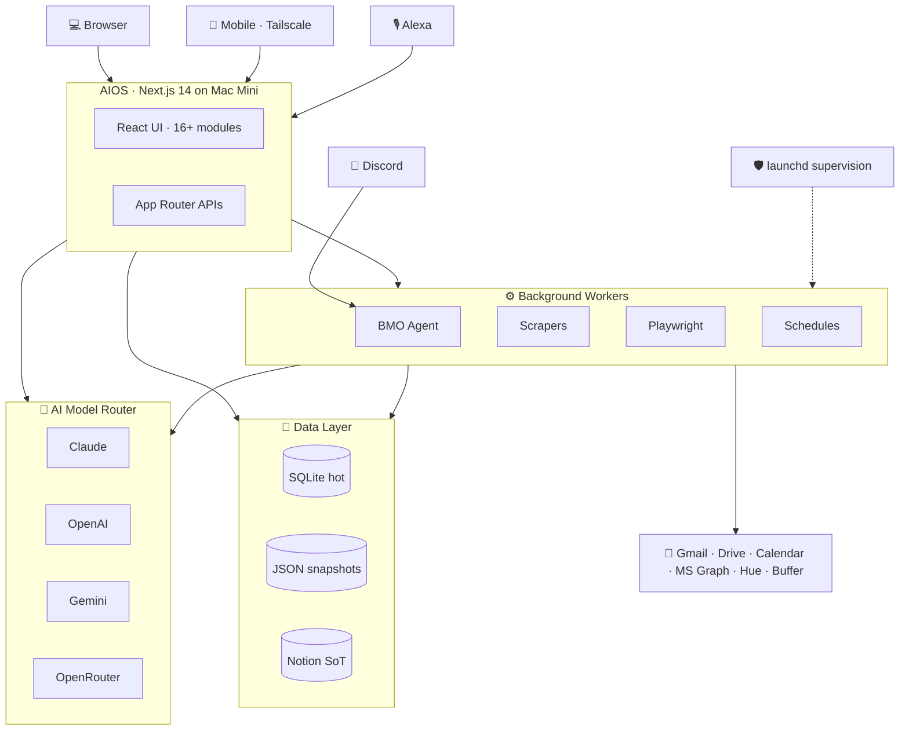

# AIOS — Personal AI Operating System

A Mac Mini-hosted, full-stack dashboard that orchestrates everything a household and a one-person business need — job pipeline, content, cloud storage, home devices, finances, and family infrastructure — all through a single local surface with Claude-powered workflows.

> *This repo is a public overview. The running code is private because AIOS is wired into personal identity, family data, and credentials.*

---

## What it is

AIOS is a single **Next.js** application running locally on a Mac Mini that acts as the front door to a personal AI Operating System. Every side of my life that used to live in its own silo — email, cloud storage, devices, tasks, calendar, finances, job search, content publishing — has a module inside AIOS and talks to a shared AI reasoning layer.

## What it does

- **Unifies 16+ operational modules** under one UI (Household, Jobs, Content, Cloud, Finance, Home Ops, Family, Vault, etc.)
- **Routes AI requests** across Claude, OpenAI, Gemini, and OpenRouter with cost-aware fallback
- **Drives a background worker pool** (scrapers, scheduled digests, Playwright automation, Notion sync) via a task queue
- **Hosts the live ops surface for [BMO](https://github.com/mikecutillo/bmo-discord-agent)** and other supervised agents
- **Syncs structured state to Notion** so mobile access and external tools share the same truth

## Architecture

**Design choices behind the diagram:**

- **Single Next.js shell** — every module is a route inside one app, not a separate service. Auth, navigation, and theming are uniform.
- **AI Model Router as a separate layer** — modules don't pin to a vendor. The router decides per-request based on cost, latency, and model fit, with waterfall fallback if a provider is down.
- **Workers, not webhooks** — scrapers and scheduled jobs run on `launchd`, write to SQLite/JSON, and surface results via the same API the UI calls. No bespoke webhook plumbing.
- **Notion as cross-domain source of truth** — only for state I want to read on a phone or share with non-AIOS tools. Everything ephemeral or hot stays in SQLite.
- **BMO as a peer agent, not a feature** — it shares the model router and data layer with AIOS but runs as its own process; AIOS gives it an ops surface, not a dependency.

## Software

| Layer | Tech |
|---|---|
| Web UI | Next.js 14, React, Tailwind CSS |
| API | Next.js App Router API routes, Node.js |
| Data | SQLite (hot), JSON snapshots, Notion (source of truth for some domains) |
| AI | Anthropic Claude, OpenAI, Gemini, OpenRouter (waterfall fallback) |
| Background | Python workers, Playwright, `launchd` supervision |
| Integrations | Gmail, Google Drive, Google Calendar, Microsoft Graph, Discord, Buffer, Notion, Hue, router SOAP |

## What this demonstrates

- **Full-stack ownership** — UI, API, data, background jobs, supervision, all under one roof
- **Multi-provider AI architecture** — not locked to one vendor, cost-aware routing, graceful degradation
- **Real daily use** — this isn't a demo; it runs 24/7 and I use it as my primary operational surface
- **Integration breadth** — 20+ third-party APIs normalized into a single dashboard

## Stack

## Related in the AIOS Portfolio

- **[BMO Discord Agent](https://github.com/mikecutillo/bmo-discord-agent)** — Discord-native family AI companion with capability-registry architecture
- **[Multi-Agent Paper Trader](https://github.com/mikecutillo/multi-agent-paper-trader)** — Multi-agent paper-trading bot with rule-based signal agents and a Claude arbiter
- **[AI Model Router](https://github.com/mikecutillo/ai-model-router)** — Multi-provider LLM router with waterfall fallback (Claude, OpenAI, Gemini, OpenRouter, local)

---

Part of the AIOS portfolio. See the [profile README](https://github.com/mikecutillo) for the full system map.
